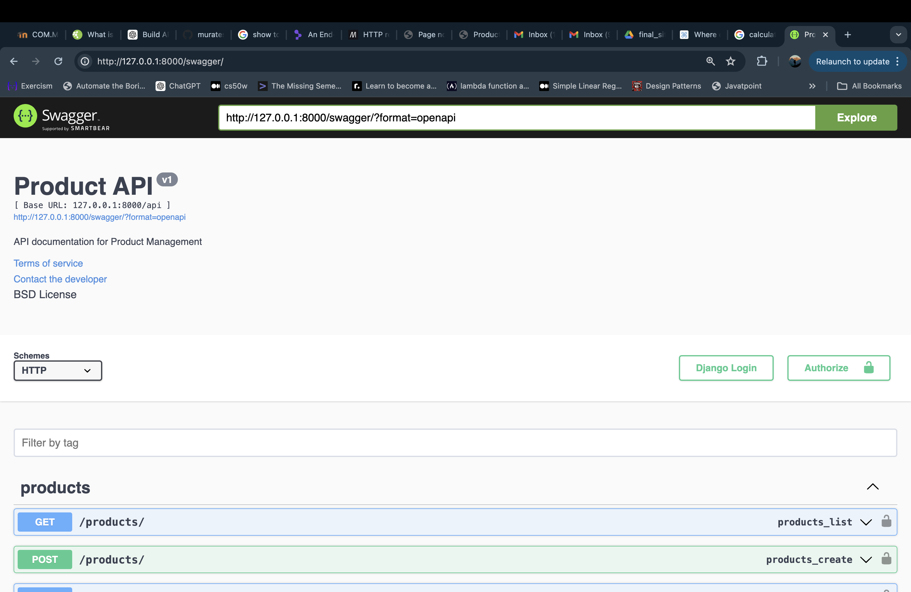
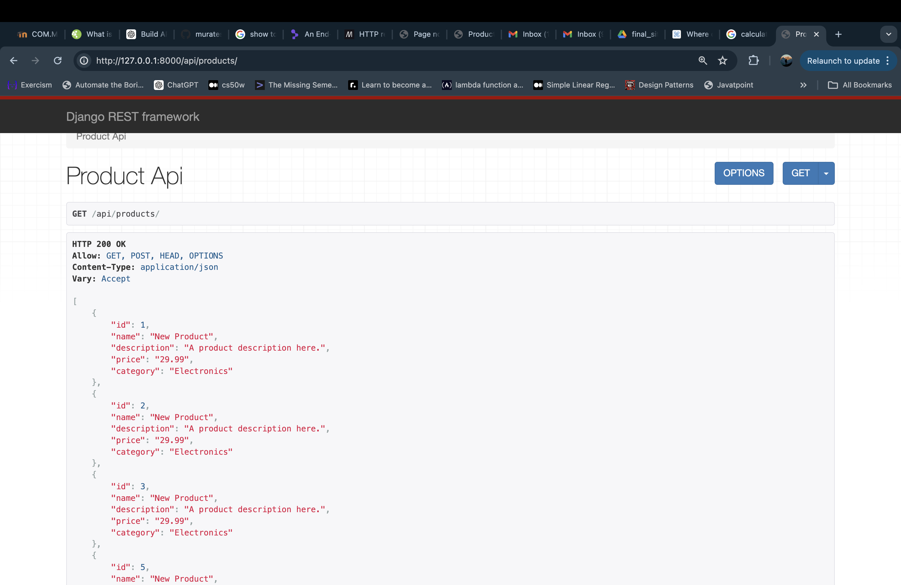
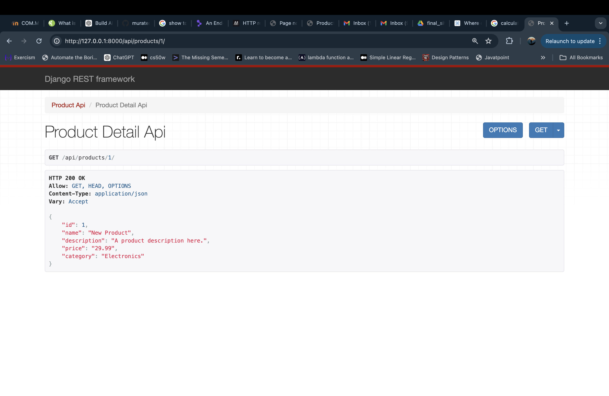

# Product Management API

**Customer company:** Startup "Acme Corp"

## Description

This project is a RESTful API developed using Django and Django REST Framework. It facilitates the management of product data, supporting features like creation, retrieval, filtering, sorting, and 404 error handling.

## API Features

- **Create Product**: Enables users to add new products to the system.
- **List All Products**: Retrieves a comprehensive list of products, with capabilities for filtering by category and sorting by price.
- **Get Product Details**: Provides detailed information on a specific product identified by its ID. It returns a 404 error if the product is not found.

## Database Schema

The database consists of a `Product` model with the following fields:

- `name`: String
- `description`: Text
- `price`: Decimal
- `category`: String

## Swagger Documentation

Swagger is utilized to document the API, offering an interactive interface to explore and test API endpoints.

## Screenshots

Here are some screenshots demonstrating the use of the API:

1. **API in Swagger UI**
   

2. **List Products Response**
   

3. **Detail View of a Product**
   

## Video Demo

### Long

[Link to long demo](https://youtu.be/UpaOQtwkQFM)

### Short

[Link to short demo](https://youtu.be/Cc_tvXht6jg)

<!-- For video demonstration of project, visit the Google Drive link:

- [Google Drive URL](https://drive.google.com/drive/folders/1ck0z_0SuAU13n52Xv1tgKGcqo_CS8cw4?usp=sharing) -->
